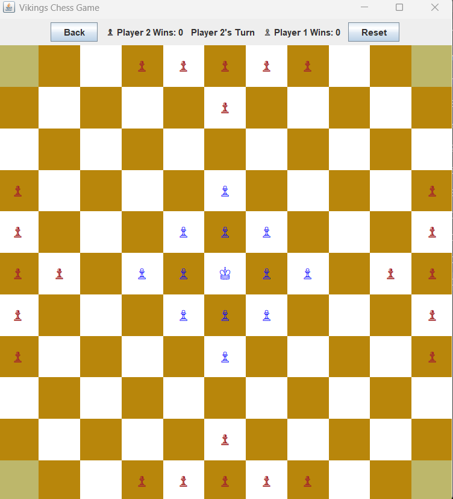

# VikingsChess – Academic OOP Assignment
*Implementation of the Hnefatafl (Viking Chess) board game as required in the course assignment.*

## 1. Project Overview
This project implements the game **Hnefatafl (Viking Chess)** using advanced Object-Oriented Programming principles taught in the course.

The implementation includes:
- Full **game logic engine**
- **Graphical user interface (GUI)** written in Java Swing
- Proper **OOP hierarchy** (inheritance, interfaces, abstract classes)
- Full implementation of **movement rules, capture rules, and win conditions**
- **Statistical output** using *Comparators* (Part B requirement)
- Optional **Undo (Back)** feature (bonus part)

All logic is implemented exclusively in the classes written by the student.  
The provided files (`Main.java`, `GUI_for_chess_like_games.java`, `Piece.java`, `Player.java`, `PlayableLogic.java`) were **not modified**, as required.

---

## 2. Game Rules (Summary)
- **Board size**: 11×11  
- **Defenders (light/blue)**: 13 pawns + King  
- **Attackers (dark/red)**: 24 pawns  
- **Goal for defenders**: Move the King to a corner square  
- **Goal for attackers**: Capture the King by surrounding him  
- **Movement**: orthogonal only, no diagonal movement, no jumping over pieces  
- **Capturing**: sandwich rule, corners act as capturing partners  
- **Victory**: King escapes or King is captured  

---

## 3. OOP Architecture (Part A)

### Class Hierarchy
```
Piece (interface)
    ↑
ConcretePiece (abstract)
    ↑
 ┌───────────────┬───────────────┐
 |               |               |
Pawn            King        (other pieces)
```

### Logic Components
```
PlayableLogic (interface)
        ↑
    GameLogic
```

### Additional Structures
- Position  
- ConcretePlayer  
- Comparators:  
  - PieceLengthCompare  
  - PieceKillsCompare  
  - PiecePositionCompare  
  - PieceSquaresCompare  

---

## 4. Implemented Classes
All classes follow exactly the assignment specifications.

---

## 5. GUI Preview

Below is a preview of the graphical interface:

<div align="center">
  
</div>

---

## 6. Statistical Output (Part B – Comparators)

Below is a real example of the output generated at the end of a game:

<div align="center">
  
</div>

This output includes:
- Sorted movement history  
- Kill count summary  
- Proper formatting with 75 asterisks  
- Follows all sorting requirements from the assignment  

---

## 7. Undo Feature (Bonus)
The `undoLastMove()` function restores:
- Board state  
- Piece positions  
- Move history  
- Kill counters  
- Turn order  

Implemented using a **stack of deep-copied game states**.

---

## 8. How to Run

### Requirements
- Java 17+
- No external libraries

### Run
```
javac Main.java
java Main
```

---

## 9. Notes
- No provided skeleton files were modified.  
- All logic implemented in student-created classes.  
- All comparators fully comply with required sorting logic.

---

## 10. Authors
Developed by:  
**Noam Cohen**  
**Bar Yechezkel**


---

## 11. Reference
Official course assignment instructions.
